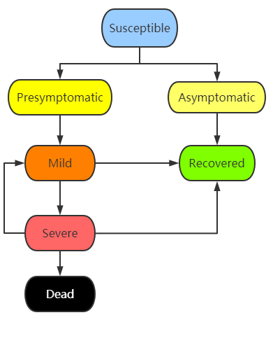

# COVID-19-Agent-based-Network-Model

The purpose of this project is to build a working computer simulation of the COVID-19 pandemic using parallel programming.
## Team B
Tech lead: TBD

- Kaijia You
- Peiqing Lu
- Tian Ding
- Xiaoxin Gan
- Xueyan Xia
- Zhelin Liao
- Ziqi Tan


## Task Instructions


- The results can easily be recognized as a representation of the workings of contagion, recovery, and death in the pandemic. The graph of new infections, for instance, should have a shape that resembles the curve produced by other standard simulations.

- The primary aim of this project is **not** to have an impressive performance or to have a simulation so realistic as to provide accurate numerical predictions, but rather to give you a good learning experience in the design of a simulation **from scratch** and its implementation by means of the standard parallel programming techniques we have learned in the course.

- The simulation should take into account social networks.  The social networks may be created randomly but should not wind up being completely connected graphs.

- Do not go shopping for ready-made, specialized libraries and software packages designed for the simulation of epidemics.  Instead, build your simulation and your implementation from the ground up.

## Epidemiology Terms
- **Susceptible** individual: a member of a population who is at risk of becoming infected by a disease.
- **Asymptomatic carrier** (healthy carrier or just **carrier**): a person or other organism that has become infected with a pathogen, but that displays no signs or symptoms.
- **Pathogen**: any organism that can produce disease.
- **Incubation period** is the time elapsed between exposure to a pathogenic organism, a chemical, or radiation, and when symptoms and signs are first apparent.
## System Model

We are going to use **an agent-based network model** to simulate the process and outcome of the spread of the COVID-19. Our COVID-19 model is based on the SIR model (Susceptible, Infectious, Recovered), which will be briefly discussed first. Then, 

### Basic SIR Model

- **Susceptible**: The number of susceptible individuals. 
- **Infectious**: The number of infectious individuals.
- **Recovered**: The number of removed (and immune) or deceased individuals.

To represent that the number of susceptible, infectious and removed individuals may vary over time (even if the total population size remains constant), we make the precise numbers a function of t (time): S(t), I(t) and R(t). We use the following ordinary differential equations to describe this process.

$$
\frac{dS(t)}{dt} = -\alpha S(t) I(t)
$$

$$
\frac{dI(t)}{dt} = \alpha S(t) I(t) - \beta I(t)
$$

$$
\frac{dR(t)}{dt} = \beta I(t)
$$

$$
0 < \alpha < 1 
$$

$$
0 < \beta < 1
$$

where alpha is the transmission rate and beta is the recover rate.


### COVID-19 Pandemic Model

We continue to integrate more factors into the basic SIR model to get our COVID-19 pandemic model.

#### Finite State Machine of an Agent

Individual has different state under such a pandemic. 

- **Susceptible**: an individual in a susceptible state is a member of a population who is at risk of becoming infected by a disease. 
- **Exposed**: an individual in the exposed state will become a presymptomatic carrier or become an asymptomatic carrier.



- **Presymptomatic**: not yet displaying symptoms of an illness or disease.
- **Asymptomatic**: not causing, marked by, or presenting with signs or symptoms of infection, illness, or disease. 
- **"Mild"** and **"Severe"** are symptomatic states. Individuals with mild symptoms may get **recovered** or get more severer (move to "Severe" state). Those in "Severe" state may have a certain **mortality** rate. 

#### Assumptions

1. Total population size remains constant. 
2. The time scale is short so that births and deaths (other than deaths caused by the COVID 19) can be neglected.
3. Individuals who get recovered from COVID 19 will not get infected again.
4. COVID-19 can spread as early as 2 days before infected persons show symptoms (presymptomatic), and from asymptomatic individuals.
5. People who get contact with infected will get infected.
5. COVID-19 cannot spread among individuals who are in a quarantine state.
6. The incubation period is typically around 5 days but may range from one to 14 days.

#### Network
- Use an array to represent agents. 
- A global clock whose time step is an hour.

#### Parallel Computing Technology
- C++ and OpenMP.
- Each thread takes care of an agent.
- Each agent polls the clock.

#### Events
- The time step is an hour. In an hour, an agent will have only one event.
- Every hour, the agent's state may transit.

#### Object-Oriented Design
- Variants of the agents.
- Social network (neighbors).
- Schedule (a list of events to do). 
- Current status: susceptible, exposed, presymptomatic, asymptomatic, 

#### Main Flow
```
Initialize the network.

global clock = 00:00, day 1
global DURATION = 10 days

Loop:
    Every agent does one thing (if any) in parallel.
    // threads join here

    Every agent updates the state in parallel.
    // threads join here

    clock = clock + 1 hour

until the end of the 10 days

```

## Statistic
Statistics and plots.


## Collaboration

| **Person in charge** and Participants | Division of labor |
|---------------------------------------|-------------------|
|        | Tech lead.        |        
|        | Documentation.    |
|        | Presentation.     |
|        | System design, Model integration and parallel computing design. |
|        | Event design and programming. |
|        | Agent object-oriented design and programming. |
|        | Use different parameter to run the simulation.  Statistics and plotting, performance evaluation. |

The **Bold name** is the name of the person in charge.

## References

[1] Wikipedia, Compartmental models in epidemiology

[2] Katia Bulekova, Brian Gregor, Eric D. Kolaczyk, Wenrui Li, and Laura White, Github project BU-COVID, August 3, 2020.

[3] Systems Sciences at SIS, A networked SIR model, http://systems-sciences.uni-graz.at/etextbook/networks/sirnetwork.html

[4] Wikipedia, COVID-19 pandemic
