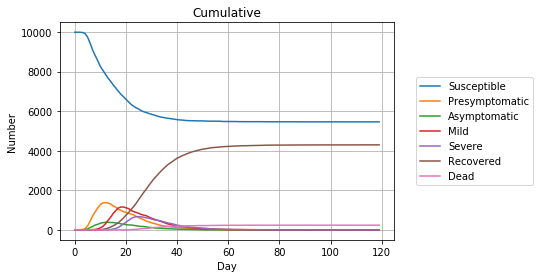

# COVID-19-Agent-based-Network-Model

## Contributors
| Member      | Work        | 
|-------------|-------------|
|  Ziqi Tan   | Tech lead. Test Use different parameters to run the simulation.  Generate a social network.|
| **Xueyan Xia**, Ziqi Tan | System design, Model integration, and parallel computing design.  |
| *Xueyan Xia*   | Generate events. Timer design and programming.  |
| **Kaijia You**, Peiqing Lu | Agent object-oriented design and programming. |
| **Tian Ding**, Zhelin Liao  | Event design and programming.  |
| Xiaoxin Gan | Statistics and plotting, performance evaluation.  |
| Zhelin Liao    | Presentation.  | 

 *The **Bold** name is the name of the person in charge.
## Introduction

### Background
The COVID-19 virus has been spreading rapidly throughout the world. At a time that no reliable vaccine or effective treatment has been developed, mathematical models and computer simulation can help us to better understand the spread of the disease, as well as give insights into how to take precise and effective precaution measures to control the spreading.

The purpose of this project is to build a program that simulates COVID-19 transmission in a population, using parallel programming techniques. Our model is an agent-based and network-based model. The output of this project is an estimation and representation of the workings of contagion, recovery, and death in the pandemic.


### Epidemiology Terms

- **Social network**: a network(graph) that depict the social connection between individuals in a population
- **Agent**: a member of a population in the social network.
- **Susceptible individual**: a member of a population who is healthy but could be infected by the virus.
- **Infected individual**: a member of a population who has been exposed to the virus, no matter the individual shows any symptom or not. The infected status persists throughout the whole disease cycle unless the individual is recovered or dead.
- **Presymptomatic carrier**: an infected individual who has no symptoms currently but will certainly have symptoms in the future. He/she can infect others.
- **Asymptomatic carrier**: an infected individual who has no symptoms currently and will not have symptoms in the future. He/she can infect others with a lower probability than that of presymptomatic carriers.
- **Incubation period**: the time elapsed between exposure to the virus, and when symptoms and signs are first apparent.
Event: the activity of an individual.

### Assumptions

1. The total population size remains constant. The model simulates the pandemic in such a short period that births and deaths (other than deaths caused by the COVID-19) can be neglected.
2. Individuals who get recovered from COVID-19 will not get infected again.
3. COVID-19 can also be spread from presymptomatic and asymptomatic individuals.
4. People who contact infected individuals may get infected with a contraction rate. The contraction rate varies in different wellness states.
COVID-19 cannot spread among individuals who are in a quarantine state.
5. The incubation period is typically around 5 days but may range from one to 14 days.
6. Every individual only has one event each hour.

## COVID-19 Pandemic Model
We are referencing an **agent-based network model** to simulate the process and outcome of the spread of the COVID-19. Our COVID-19 model is based on the traditional SIR model (Susceptible, Infectious, Recovered).

**Basic SIR Model**
- **Susceptible**: The number of susceptible individuals. 
- **Infectious**: The number of infectious individuals.
- **Recovered**: The number of removed (and immune) or deceased individuals.

To represent that the number of susceptible, infectious and removed individuals may vary over time (even if the total population size remains constant), we make the precise numbers a function of t (time): S(t), I(t) and R(t). We use the following ordinary differential equations to describe this process.

```
dS(t)/dt = - alpha S(t) I(t)

dI(t)/dt = alpha S(t) I(t) - beta I(t)

dR(t)/dt = beta I(t)

0 < alpha < 1 

0 < beta < 1
```
where alpha is the transmission rate and beta is the recover rate.

### Main flow
1. Create an array of agents as the social network.
2. Initialize the agents with the index of them as their unique identifications and the initial number of presymptomatic individuals.
3. Initialize the network with **Barabási–Albert (BA) algorithm**. 
4. Get the instance of the global unique clock. Now, the clock is ticking. The time step is one hour.
5. Enter a while loop: 
    1. If the current hour is a working hour, generate a patch of meeting events and social interactions, and dispatch them to the corresponding agents. The agents who have neither meeting nor social interaction will have a “stay alone” event. Then, every agent executes their events **in parallel**. 
    2. If it is sleeping time, do nothing. 
    3. Update each agent’s state **in parallel**.
    4. Go on to the next hour. If it gets to the end of the simulation, break the loop. If this is the end of a day, generate statistics for today.

### Social Network Design
- Data structure: an array of agents, each of which stores a vector of agents as his/her neighbors. 
- Initialization: we use a Barabási–Albert (BA) algorithm[5] to initialize the network. This algorithm has a basic idea to simulate the social network in practice. That is, an individual with higher degrees will have a lower probability of getting connected with a new individual. With this constraint, a node will not become a supercenter node in a social network.  We implement a simple version: 
	1. Initialize part of the network G, then we get a network G’.
    2. Add a new node to G’. This node will connect to a node (denoted as n’) in G’ with a probability of 1 / (# neighbors of n’ + 1). 
	Time complexity: O(N^2) where N is the size of the network G.


### Agent Design
An agent is an individual in the network, it has some attributes as the followings:
1. **Identification**: an integer that represents the index of the agent in the social network which is defined above.
2. **Wellness state**: a data type of enum that represents the current health state of the agent, such as initial, susceptible, asymptomatic, presymptomatic, mild, severe, dead, and recovered.


3. **Next state**: also a data type of enum. We want to read the wellness state of all agents and execute the event of all agents at the same time slot in a parallel way and update their wellness state parallelly before the next time slot begins. For this reason, an agent needs an attribute that records the next state to eliminate the race condition.
4. **Event**: An Event class that is defined below. The main function will assign events for each agent through some algorithms, agents should know their own event and execute it in an OpenMP way.
5. **Neighbors**: a vector of Agent types. The main function will assign neighbors for each agent through some algorithms. For meeting events, they will only take place among neighbors. For social activity events, they will not only take place among neighbors but also take place randomly.
6. **The incubation period (days)**: an integer to declare that only after such time will the agent go from a presymptomatic state to the next possible state. The incubation period is produced by a random number generator in a normal distribution with an expectation of 7 days and a variance of 2 days.
7. **The mild period (days)**: an integer to declare that only after such time will the agent go from a mild state to the next possible state. It is generated by a random number generator in a uniform distribution.
8. **The severe period (days)**: an integer to declare that only after such time will the agent go from a severe state to the next possible state. It is generated by a random number generator in a uniform distribution.
9. **The asymptomatic period (days)**: an integer to declare that only after such time will the agent go from an asymptomatic state to the next possible state. It is generated by a random number generator in a uniform distribution.
10. **The state duration (hours)**: An integer to record the duration of the agent’s current state which is represented in hours. When this attribute divided by 24 is greater than or equal to any of the above attributes, the state change function will be triggered. It is generated by a random number generator in a uniform distribution.

#### Event execution
There are two situations when executing an event here:

1. Get infected by others with a probability: when the wellness state of the agent is susceptible and it attends an event where there are infected individuals. Then, there is a possibility that it will get infected. In order to simulate the workings of the disease in the population network, we need to model the following factors:

    - Contraction rate: an infected individual under different wellness states has different probabilities to infect a susceptible individual. To simplify the problem, we predefine the probability. For example, a susceptible agent i has an encounter with a mild symptom agent j:

        ```
        P{ i get infect when agent j state is mild} = a
        P{ i get infect when agent j state is severe} = b
        P{ i get infect when agent j state is presymptomatic} = c
        P{ i get infect when agent j state is asymptomatic} = d
        ```
        if the interaction involves more than two individuals, then the probability of agent i get infected when meeting with n people is:
        ```
        P = 1-(1-P1)(1-P2)(1-P3)(1-P4)...(1-Pn)
        ```
    - Wellness state transmission probability: the probability of an infected individual's current wellness state moves to the next state, including recovery rate and mortality rate. For example, agent i under the state of susceptible then,

        ```
        P( Presymptomatic | susceptible ) = p
        P( Asymptomatic | susceptible ) = q
        p + q = 1
        ```
2. Update the wellness itself: 

    - stay alone: for presymptomatic and asymptomatic, if stateDurationHours / 24 >= incubationPeroid or asymptomaticPeroid then it will go to the next state; For susceptible, do nothing; For mild, if stateDurationHours / 24 >= mildPeroid then check if the number got from coin flip is smaller than or equal to the probability of MILD_TO_SEVERE or not, if yes, the nextState is changed to be severe. Otherwise, it is changed to be recovered; For severe, if stateDurationHours / 24 >= severePeroid then check if the number got from coin flip is smaller than or equal to the probability of SEVERE_TO_DEAD or not, if yes, the nextState is changed to be dead. Otherwise, it is changed to be recovered;
    - get infected and attend the event: because the agent is infected, regardless of whether there is an infected person in the event or not, it will not make the already infected agent more serious. It will only update its wellness state based on the incubation period and the result of the coin flip.


### Event Design
To simplify social interaction, we only consider three scenarios:
   - Meeting other people (only with the neighbors)
   - Social activities (may contact anyone, not only the neighbors)
   - Stay alone (without social event, i.e. quarantine)

Here is the object-oriented design of our event models:


In the parent class Event, we only record the number of people with different states, such as Mild, Severe, Presymptomatic, Asymptomatic, in order to transfer the state more easily.

For future extension: we can extend event class to differentiate social events from different social network models and virus contraction rates such as public transportation events, class events, and dining events.

### Event Generator
We design two types of transmission events here to simulate social activities that happen in our daily life. In each WORKING hour, from 8 a.m. to 10 a.m., we would generate several kinds of events for people. Other time slices are SLEEPING hour,  at that time people would transfer their state automatically but they would not participate in any event, which means there is no possible way to infect Covid-19.

#### Meeting 
Meeting events have a higher priority in our design because they are considered as settled plans in our life. For instance, they could be taking a course,  having a meeting with friends, attending an academic conference, etc.

We could assign a random number for events that happen in an hour. In each event, we only encounter people we already know, which means the people who attend the event would at least have one connection in our social network. 

Firstly, we choose a person who would launch an event. Then randomly choose some people in his connections and let them have opportunities to participate in this event. Next, whether these people would join in this event depends on the probability. Finally, if a person decides to be a member of this meeting, his event attribute would be changed to “Meeting”, otherwise this attribute would be “STAY_ALONE”, which is a non-transmission event, people under this circumstance has no chance to be infected Covid-19.

#### Social Interactions
Social interactions would be generated next to meeting events. We assumed that people who don't have a schedule would go out every day and come across a lot of people, whether he knows them or not. 

Similar to meeting events, social interactions would happen several times in an hour. In order to make our simulation closer to social activities in real life, we have a series of parameters to regulate the frequency and number of people about social interaction events. By setting the maximum and a minimum number of people in a social event, we could ensure Covid-19 expanded sufficiently and appropriately.

When randomly choosing people from the social network, we need to ensure those people are not occupied by other events. Besides, there exists possible as well that people may not go out and join in social interactions, under a condition of “STAY_ALONE”, as we defined in meeting events.

#### Parallel Techniques
Considered that only limited code blocks in our main flow would completely not depend on the previous state, we have the following strategies. 

When transferring states of our agents and executing events, we use openMP parallel techniques to speed up our computing. Specifically,  #pragma omp parallel is used with for loops, which could be translated by the compiler to assign a team of threads to  execute the statements in the scope parallelly.

The number of threads is acquired by the omp_get_max_threads() function in the OpenMP library, which would get the maximum number of threads that could run in a specific CPU.

## Execution
Project file structure:
- Mainflow
    - main.cpp
    - Makefile
    - params.cpp
    - params.hpp
    - init
    - Time
        - Clock
        - Hour
    - Agent
        - agent
        - wellness
    - Event
        - Event
        - TransmissionEvent
        - NonTransmissionEvent
        - Meeting
        - SocialActivity
        - StayAlone

### Dependencies and Compile Instructions
**Dependencies**: C++ compiler and OpenMP library.

**Compile instructions** (at the root of the “Mainflow” folder):
- Mac OS: Run `make` to compile. Then you will see the `main` executable file. Run `./main` to run the simulation. 
- Window OS: Run `mingw32-make` to compile. Then you will see the `main.exe` executable file. Run `./main.exe` to run the simulation.

**Note: remove all `.o` files before the next execution.**

### Parameters

All tunable parameters are in the “params.hpp” file.

**Network:**
- Network size: integer.
- Simulation days: integer.

**Event:**
- The maximum number of agents for each social event: integer.
- The minimum number of agents for each social event: integer.
- The probability that an agent will attend the event when being assigned an event: float.
- The number of meetings/social activities each hour: integer.

**Infection rates: float.**
- P{ i get infect when agent j state is mild} = a
- P{ i get infect when agent j state is severe} = b
- P{ i get infect when agent j state is presymptomatic} = c
- P{ i get infect when agent j state is asymptomatic} = d

**The probability of transferring from susceptible to presymptomatic/asymptomatic
if get infected: float.**

**Incubation period:**
- The initial number of presymptomatic individuals: integer.
- The maximum days of the incubation period: integer.
- The minimum days of the incubation period: integer.
- The expectation days of the incubation period: integer.
- The variance days of the incubation period: integer.

**Asymptomatic:**
- The maximum days of the asymptomatic period: integer.
- The minimum days of the asymptomatic period: integer.

**Mild:**
- The maximum days of the mild period: integer.
- The minimum days of the mild period: integer.
- The probability that an agent in a mild period transfers to a severe period: float.

**Severe:**
- The maximum days of the severe period: integer.
- The minimum days of the severe period: integer.
- The probability that an agent will die: float.

## Simulation and Statistics
Among all the simulations, we select a typical one to show. 

## Parameters
```C++
const static unsigned int RANDOM_SEED = 10;

/* Network */
const static int SIMULATION_DAYS = 120;
const static int NETWORK_SIZE = 10000;  

/* Event generator */
const static int MAXIMUM_NUM_OF_AGENTS_EACH_SOCIAL_EVENT = 30;
const static int MINIMUM_NUM_OF_AGENTS_SOCIAL_EVENT = 10;
const static float EXECUTE_METTING_EVENT = 0.7;
const static float EXECUTE_SOCIAL_EVENT = 0.5;
const static int NUM_OF_MEETING_EACH_HOUR = 20;
const static int NUM_OF_SOCIAL_EACH_HOUR = 40;

/* P{ i get infect when agent j state is mild} = a */
const static float INFECTION_RATE_MILD = 0.6;
/* P{ i get infect when agent j state is severe} = b */
const static float INFECTION_RATE_SEVERE = 0.7;
/* P{ i get infect when agent j state is presymptomatic} = c */
const static float INFECTION_RATE_PRESYMPTOMATIC = 0.5;
/* P{ i get infect when agent j state is asymptomatic} = d */
const static float INFECTION_RATE_ASYMPTOMATIC = 0.3;

/* the probability of transferring from susceptible to presymptomatic/asymptomatic
if get infected */
const static float INFECTIOUS_TO_PRESYMPTOMATIC = 0.8;
const static float INFECTIOUS_TO_ASYMPTOMATIC = 0.2;

/* It may take 1 ~ 14 days to show symtoms */
static int INITIAL_NUM_OF_PRESYMTOMATIC = std::max(10, NETWORK_SIZE / 3000);
const static int MAX_INCUBATION_PEROID = 14;        // days
const static int MIN_INCUBATION_PERIOD = 3;         // days
const static int INCUBATION_EXPECTATION = 7;        // days
const static int INCUBATION_VARIANCE = 2;           // days

/* Asymptomatic */
const static int MAX_ASYMPTOMATIC_PERIOD = 13;      // days
const static int MIN_ASYMPTOMATIC_PEROID = 5;       // days

/* after this period, agent will have a high probability to get severe */
const static int MAX_MILD_PERIOD = 9;       // days
const static int MIN_MILD_PERIOD = 4;       // days
const static float MILD_TO_SEVERE = 0.6;    // probability

/* after this period, agent will have a high period to die */
const static int MAX_SEVERE_PERIOD = 9;         // days
const static int MIN_SEVERE_PERIOD = 4;         // days
const static float SEVERE_TO_DEAD = 0.1;       // probability

```

### Statistics
In our simulation, in the first 10 days, the number of infected cases grows rapidly and reaches a peak on about the 20th day. Then, the lines converge on the 60th day. Figure 1 shows the overall statistics on this process. 



Figure 2 shows the daily casualty. On the 10th day, the infection reaches a peak of 1400 presymptomatic individuals and 400 asymptomatic individuals. Then, the peak of mild and severe follow, reaching 1200 mild cases and 630 severe cases, respectively. 


Figure 3 shows the daily diagnosis cases and cumulative diagnosis cases. Diagnosis individuals include presymptomatic, asymptomatic, mild, and severe agents.


Figure 4 shows the mortality.


## Discussion

### Conclusions

Our model reasonably reproduces the process of contagion, recovery, and death in the pandemic. We spare no effort to make our scenario close to reality. In the simulation, we can see the growth of the number of confirmed cases and the peak of it. Then, many agents recovered from the disease while some agents didn’t make it, unfortunately. Finally, the virus disappeared, because many people get immune to it and the virus has no host and carrier to survive.  However, there are still some drawbacks in the simulation and we will discuss them in the following sections.

### Bottlenecks

1. As we discussed in section 2.1, the time complexity of the BA algorithm is O(N^2). Thus, when initializing the network, it will take a long time.
2. Due to the design of the network, we have to dispatch the events in a sequential way to avoid race conditions. Let’s go through a simple example to see why events cannot be generated and dispatched in parallel. Now, parallelly, we generate a meeting for person A and person B and another social activity with participants person B and person C. In this case, person B cannot have two events in an hour. 


### Future work
1. COVID-19 Test. An agent with a positive test result will have a lower probability to attend social events and even quarantine himself/herself. 
2. Intervention. When people put on a face mask and keep social distance, the infection rate will decrease.
3. The age and gender of an agent will have various mortality. 
4. Geospatial design. People may get in contact at different distances, which influences the infection rate.
5. The data structure of the network seems not friendly to parallel computing.
6. Transplant the model to a CUDA  environment to play parallel computing.
7. A possible vaccine will be produced.


## References

[1] Wikipedia, Compartmental models in epidemiology

[2] Katia Bulekova, Brian Gregor, Eric D. Kolaczyk, Wenrui Li, and Laura White, Github project BU-COVID, August 3, 2020.

[3] Systems Sciences at SIS, A networked SIR model, http://systems-sciences.uni-graz.at/etextbook/networks/sirnetwork.html

[4] Wikipedia, COVID-19 pandemic

[5] Wikipedia, Barabási–Albert model