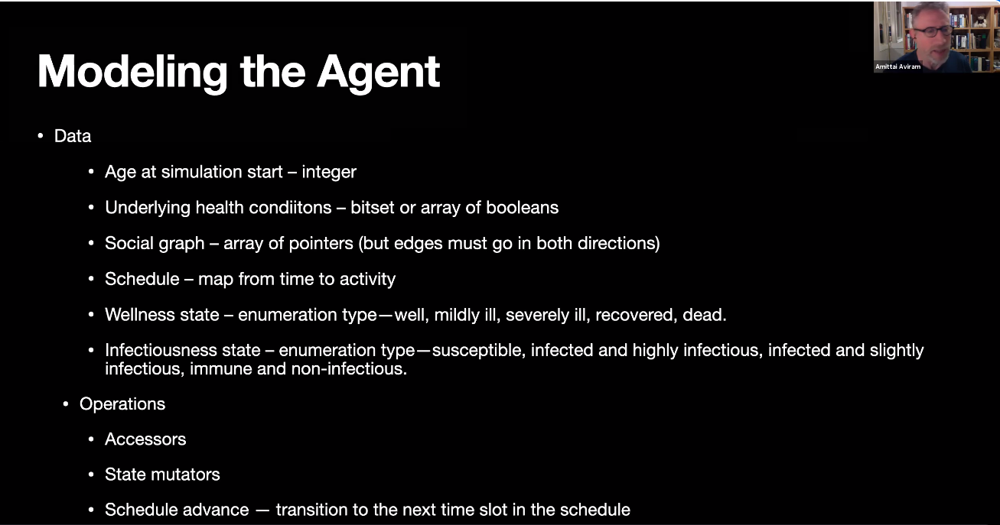
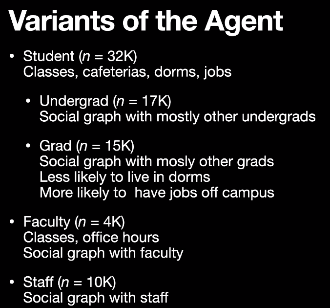
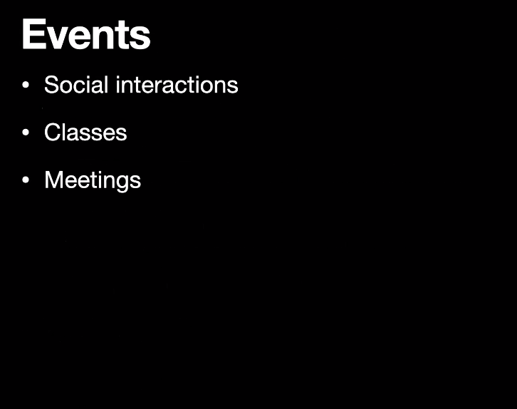
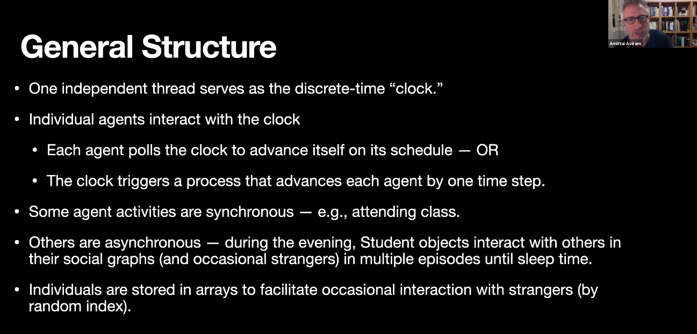
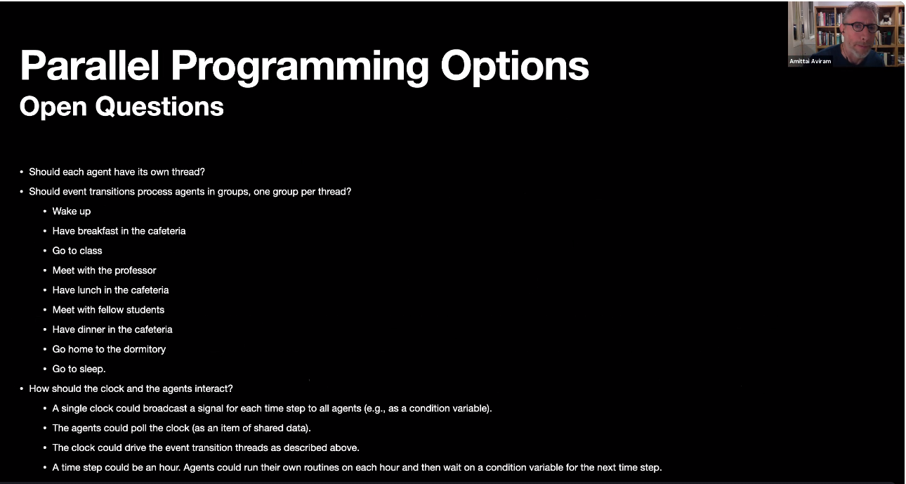
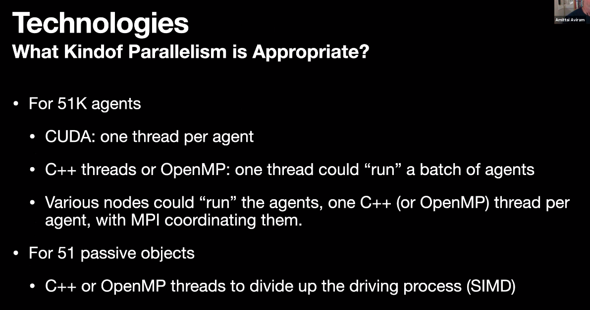
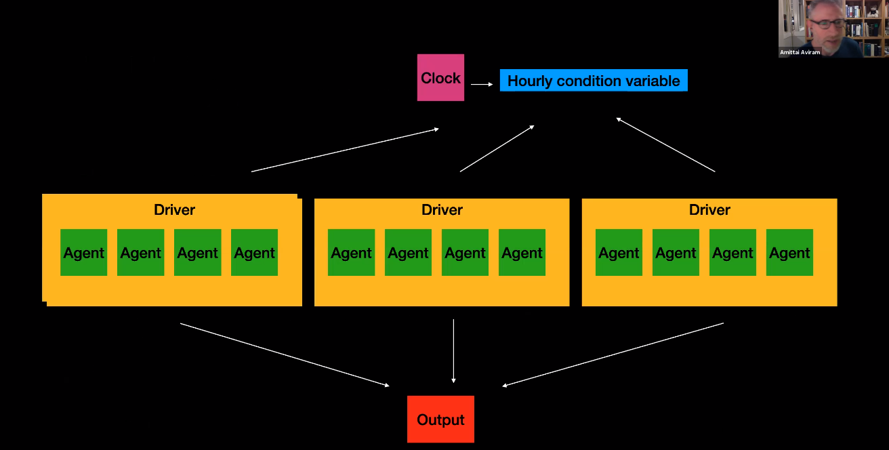

# Final Project: Simulation of the COVID-19 Pandemic
The purpose of this project is to build a working computer simulation of the COVID-19 pandemic using parallel programming.  **Your team is free to design a reasonable and practicable simulation** and to choose the parallel programming technologies to implement the simulation.  Please note the following guidelines:

- By "reasonable," I mean such that the results can easily be recognized as a representation of the **workings of contagion, recovery, and death** in the pandemic.  The graph of new infections, for instance, should have a shape that resembles the **curve** produced by other standard simulations.
- The simulation should take into account **social networks**.  The social networks may be **created randomly** but should not wind up being completely connected graphs.
- The primary aim of this project is not to have an impressive performance or to have a simulation so realistic as to provide accurate numerical predictions, but rather to **give you a good learning experience in the design of a simulation from scratch and its implementation by means of the standard parallel programming techniques** we have learned in the course.
- Accordingly, please do not go shopping for ready-made, specialized libraries and software packages designed for the simulation of epidemics.  Instead, build your simulation and your implementation **from the ground up**.
- The statistical techniques and algorithms covered in the appendix to the book cited by Eric Kolaczyk should be helpful.  It is posted under "Textbooks and Resources" in the Content area.

The project will require the following milestones and deliverables:

- By class time on December 1st, you should have your team membership determined through the sign-up sheets, and each team should have elected **a tech lead**.
- In class on December 8th, each team will give a presentation of 20 to 30 minutes of its plans.  This should include
    - A detailed description of the **simulation**, including any mathematical reasoning.  (Be sure to define all of your **terms**!  Assume that your audience does not know much about statistics or simulations.)
    - A description of the **parallel programming technologies** you plan to use and how you plan to use them—on what part of the simulation and in what way.
    - A tentative plan of **who will do what** to contribute to the project.
- By the deadline, on December 15th, each team will need to turn in to me
    - Its code base
    - A write-up, including
        -   A detailed description of the simulation, as above, but corrected for any changes you make in the process of development
        - A description of the implementation, likewise updated
        - A list or table of who did what.

